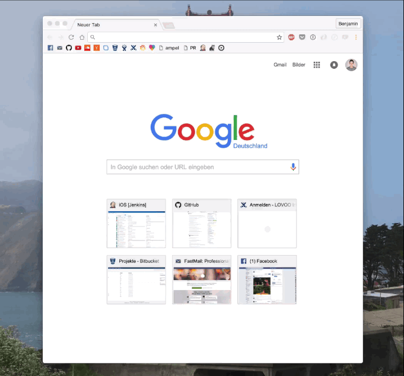
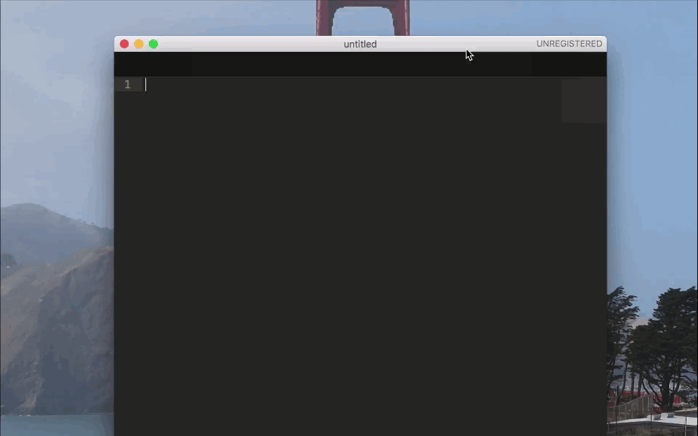

# Pod Search Alfred #

Use this workflow to search for Cocoapods with Alfred.

## Install ##

To install the workflow, you need the premiun version of Alfred. Then only download the latest release from [releases](https://github.com/BenchR267/Pod-Search-Alfred/releases) and open it. Done!

## Features ##

With this workflow you can:

- search for Cocoapods within Alfred
- open the website or documentation for the given pod from Alfred
 

- copy and insert the install instructions ready to use in your Podfile
 
